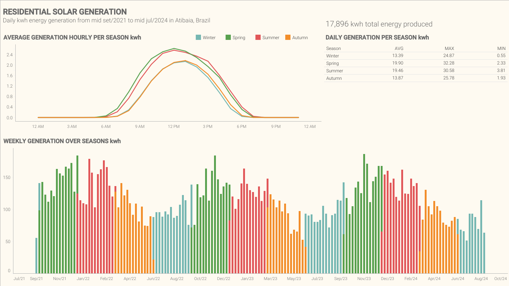
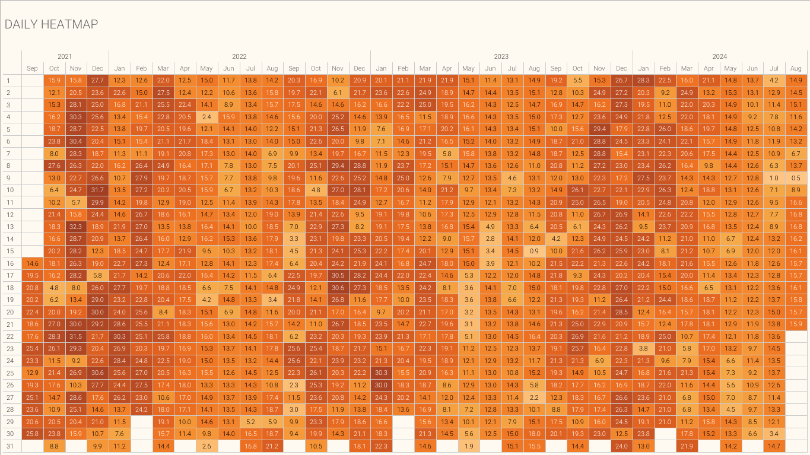

# Home Solar: From Scrape to Insights
[Versão Português](https://github.com/lksprado/Solar/blob/main/README.md)

## What is the project?
It is a pipeline that log in a solar generation system, extracts and transforms production data from a home solar IoT system with no public API. This repository focuses on extraction and transformation — designed to plug into a personal Airflow repository as a submodule.

**Notes on scope**: 
1. This project is a submodule of a personal Airflow setup. The load stage is intentionally not included here.
2. This is a personal, non-replicable setup tailored to a specific provider.

## Why This Exists
- No official API: Data is hidden behind a login and a specific app view that enables an internal API.
- Practical engineering: Demonstrates resilient scraping, structured transformations, and testable Python without over-engineering.
- Personal analytics: Feeds a simple, consistent dataset for downstream visualization.

## What It Does
- Logs into the solar provider’s portal and fetches historical and current production data.
- Transforms raw JSON into tidy, analysis-ready DataFrames (hourly and daily summaries).
- Writes control artifacts (e.g., missing date lists) to ensure continuity and idempotency across runs.

## Tech Stack
- Selenium: Reliable browser automation to reach the internal API endpoints.
- Python + OOP: Clear separation of concerns and maintainability.
- Pytest: Function-level tests for critical components.
- Logging: Structured logs to aid debugging and observability.

## Key Modules
- `src/missing_raw.py`: Identifies dates with missing data from local DB and writes them to a control file.
- `src/extraction.py`: Authenticates and pulls raw JSON from the portal (via Selenium-enabled flows).
- `src/transforming.py`: Parses JSON to pandas DataFrames and produces hourly and daily aggregates.
- `main.py`: Example runner wiring the steps together for local/debug usage.

Associated tests are in `tests/` for extraction, transformation, and (where applicable) database-related helpers.

## Typical Flow
1) Identify gaps: Generate/update a list of missing dates.
2) Extract data: Log in, navigate to the correct view, and request per-date JSON.
3) Transform data: Normalize, clean, and aggregate into hourly and daily tables.

Downstream loading/orchestration is performed by Airflow in the parent private repository.

## Visualizations
Dashboard: https://public.tableau.com/app/profile/lucas8230/viz/HOMESOLARPANELPRODUCTION2021-2024/Painel1

