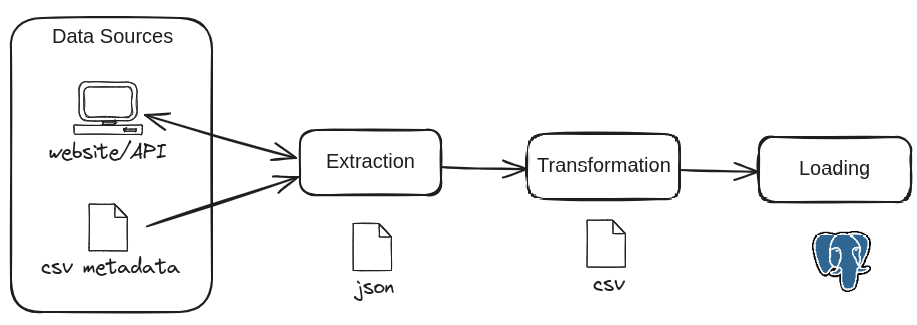

# HOME SOLAR PANEL DATA FROM ETL TO VIZ

### MOTIVATION AND CHALLENGE
This is a personal webscrapping project that emulates and end-to-end solution applying data engineering fundamentals and python developing best practices. The goal is to extract, transform, and visualize solar panel data from my family's home system. It is not designed to be replicable.

The overall challenge is to get the historical and current data from the home solar system without a proper API. It is necessary to log in into the website and get to a specific page that enables the API endpoint.

### TOOLS
- Selenium: Automates the web interaction required for data extraction
- Postgres: Database for storing and managing the collected data

### TECHNIQUES APPLIED:
- OOP Object-Oriented Programming developing;
- Data Warehousing and ETL concepts;
- Pytest for testing functions;
- Logging; 

### FILE DESCRIPTIONS
The structure is designed to resemble a DW enviroment and focus on prioritizing execution recording\
`bronze/json_files`: Directory stores the extracted json files as a landing zone;\
`hourly24_production_2024-08-15.json`: Json file sample;\
`missing_dates.csv`: CSV file stores the dates that are missing from the `json_files` directory and writes the dates data was not collected;\
`silver/csv_files`: Directory which the json data transformed is stored as csv;\
`transformation_status.csv`: Logging file to store if transformation was success or not\
`silver/sql_table_done`: Directory that moves the files once they are uploaded to Postgres

It consists of 4 steps:

1. Missing.py   
Cross-checks with the current date to identify missing dates and list them in a CSV file;

2. Extraction.py    
It starts a Webdriver instance, logs into the EmaApp System, navigates to desired page, makes a GET request for daily hourly energy production from the given dates listing in "missing_dates.csv" file; 

3. Transformation.py    
Converts Json to csv file, remove unecessary columns, parses data and creates csv files in a processed directory;

4. Loading.py   
Uploads csv file contents from processed directory to Postgres staging table and calls function to insert in the final table, moves the loaded files to a subfolder;

5. Gather.py
Creates a single csv with all the content, for data visualization purposes in Tableau

### WORKFLOW

### ANALYSIS
The Viz can be accessed in the following link: https://public.tableau.com/app/profile/lucas8230/viz/HOMESOLARPANELPRODUCTION2021-2024/Painel1

